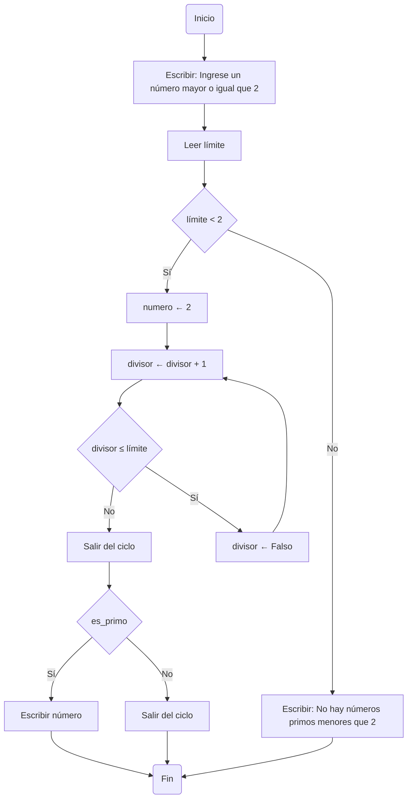

# Numeros-Primos

### Para este reto desarrollaré un algoritmo que identifique todos los números primos que sean menores o iguales a un número natural n.


## Pseudocódigo

```
[Variables]
n : entero            // Límite superior para buscar primos
x : entero            // Número actual a verificar
y : entero            // Posible divisor de x
es_primo : lógico     // Indica si x es primo

Inicio
    Escribir "Ingrese un número mayor o igual que 2:"
    Leer n

    Si n < 2 entonces
        Escribir "No hay números primos menores que 2."
    Sino
        Para x desde 2 hasta n hacer
            es_primo ← Verdadero

            Para y desde 2 hasta trunc(raiz(x)) hacer
                Si x mod y = 0 entonces
                    es_primo ← Falso
                    Salir del ciclo
                FinSi
            FinPara

            Si es_primo entonces
                Escribir x
            FinSi
        FinPara
    FinSi
Fin
```

## ¿Qué hacer el código?

- El algoritmo revisa cada número x desde 2 hasta n, y para cada uno:

1. Asume que x es primo.

2. Busca divisores y desde 2 hasta √x (raíz cuadrada de x).

3. Si encuentra un número y tal que x % y == 0 (es divisible), entonces: x no es primo. Se interrumpe la revisión (ya no hay necesidad de seguir buscando).

4. Si no encuentra ningún divisor, entonces: x es primo y se muestra en pantalla.

## ¿Por qué solo hasta √x?

Porque si un número tiene un divisor mayor que su raíz cuadrada, ya tendría un divisor menor correspondiente (por ejemplo, si x = 36, 6 × 6 = 36, pero si pruebas con 9, ya encontraste 4 como su pareja: 4 × 9 = 36). En este ejemplo la raíz de 36 es 6, 36 tiene como divisor a 9, 9 es mayor a la raiz de 36. 36 no es primo.


## Diagrama de flujo

Teniendo en cuenta que:
- Limite es n, osea el número hasta donde vamos a buscar los números primos.
- Número es x, el número el cual estamos verificando si es primo o no.
- Divisor es y, posible divisor de x.



# BUENO MUCHAS GRACIAS.


   
